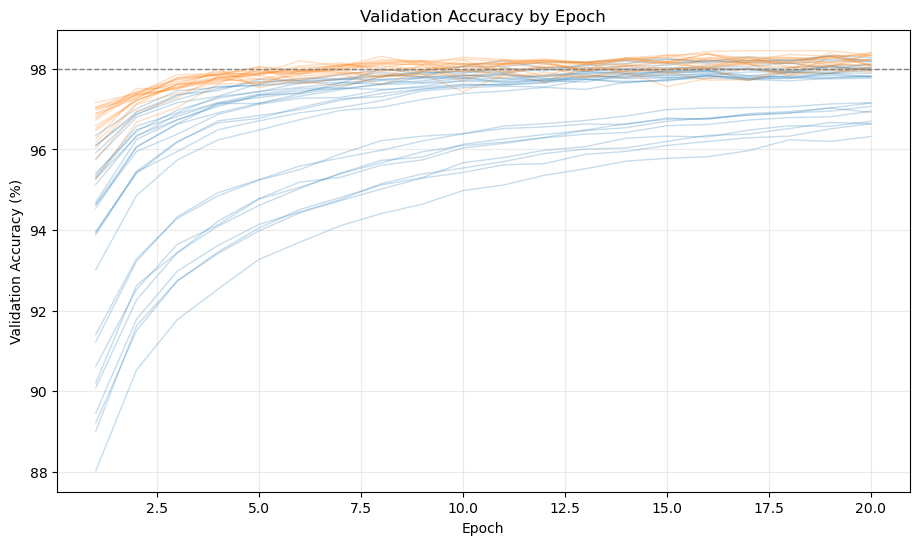
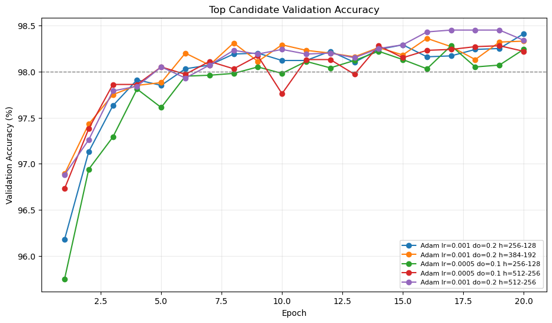
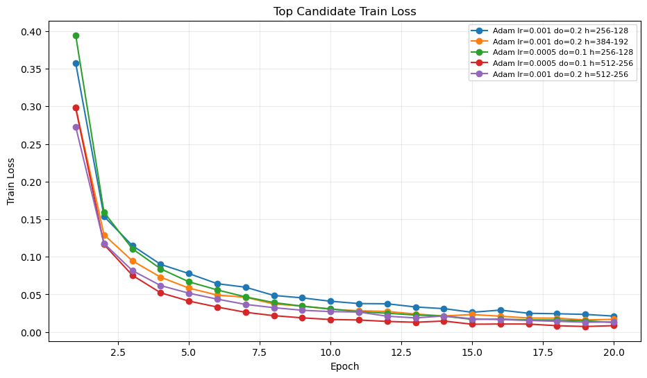
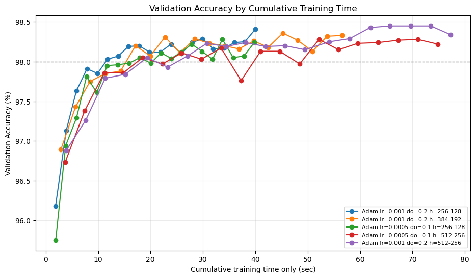

# MNIST 손글씨 인식 과제 보고서

## 0. 반·팀원

| 항목 | 내용 |
| --- | --- |
| 반 | SW-AI 12기 본과정 |
| 팀명 | 3팀 |
| 팀원 | 주호석, 정찬빈, 김동현 |

---

## 1. 실험 목적

본 과제의 목적은 PyTorch, TensorFlow 같은 딥러닝 프레임워크 없이 NumPy만 사용하여 MNIST 손글씨 숫자 분류 신경망을 직접 구현하는 것이다. 28x28 이미지를 784차원 벡터로 펼친 뒤, 여러 layer를 거쳐 0부터 9까지의 숫자 중 하나로 분류한다.

정확도 목표는 테스트 정확도 97% 이상이며, 단순히 정확도를 맞히는 것뿐 아니라 `Forward -> Loss -> Backward -> Optimizer Update` 흐름을 팀원이 설명할 수 있도록 구현과 실험을 함께 진행했다.

---

## 2. 모델 구조

| 구분 | 내용 |
| --- | --- |
| 입력 | 784차원 벡터. MNIST 28x28 픽셀을 flatten하고 0~1 범위로 정규화 |
| 은닉층 1 | Affine(784 -> 256) -> BatchNorm -> ReLU -> Dropout |
| 은닉층 2 | Affine(256 -> 128) -> BatchNorm -> ReLU -> Dropout |
| 출력층 | Affine(128 -> 10) -> Softmax |
| 손실 함수 | Cross Entropy Loss |
| 파라미터 수 | BatchNorm 사용 기준 235,914개 |

최종 선택 모델의 구조는 다음과 같다.

```text
입력 784
-> Affine(256)
-> BatchNorm
-> ReLU
-> Dropout
-> Affine(128)
-> BatchNorm
-> ReLU
-> Dropout
-> Affine(10)
-> Softmax
```

초기 기준 모델은 `784 -> 512 -> 256 -> 10` 구조였지만, 비용 대비 정확도 실험에서는 같은 block 순서를 유지한 채 hidden layer 크기를 줄인 `784 -> 256 -> 128 -> 10` 구조가 더 좋은 선택으로 나타났다.

최종 선택 모델을 Mermaid 구성도로 표현하면 다음과 같다.

```mermaid
flowchart LR
    subgraph INPUT_LAYER["입력층"]
        I["MNIST 입력<br/>28x28 -> 784"]
    end

    subgraph HIDDEN_LAYER["은닉층"]
        direction LR

        subgraph HIDDEN_LAYER_1["은닉층 1"]
            direction LR
            A1["Affine<br/>784 -> 256"]
            BN1["Batch<br/>Norm"]
            R1["ReLU"]
            D1["Dropout"]
        end

        subgraph HIDDEN_LAYER_2["은닉층 2"]
            direction LR
            A2["Affine<br/>256 -> 128"]
            BN2["Batch<br/>Norm"]
            R2["ReLU"]
            D2["Dropout"]
        end
    end

    subgraph OUTPUT_LAYER["출력층"]
        A3["Affine<br/>128 -> 10"]
        S["Softmax"]
    end

    I --> A1
    A1 --> BN1
    BN1 --> R1
    R1 -->|"학습 시"| D1
    D1 --> A2
    R1 -->|"테스트 시"| A2
    A2 --> BN2
    BN2 --> R2
    R2 -->|"학습 시"| D2
    D2 --> A3
    R2 -->|"테스트 시"| A3
    A3 --> S

    classDef input fill:#202124,stroke:#202124,color:#ffffff;
    classDef affine fill:#ffffff,stroke:#9aa0a6,stroke-width:2px,color:#202124;
    classDef norm fill:#d9d9d9,stroke:#9aa0a6,stroke-width:2px,color:#202124;
    classDef act fill:#ffffff,stroke:#9aa0a6,stroke-width:2px,color:#202124;
    classDef dropout fill:#f7f7f7,stroke:#b0b0b0,stroke-width:1px,stroke-dasharray: 4 3,color:#202124;

    class I input;
    class A1,A2,A3 affine;
    class BN1,BN2 norm;
    class R1,R2,S act;
    class D1,D2 dropout;

    style INPUT_LAYER fill:#f5f7fa,stroke:#c8ccd0,stroke-width:1px,color:#202124;
    style HIDDEN_LAYER fill:#ffffff,stroke:#c8ccd0,stroke-width:1px,color:#202124;
    style HIDDEN_LAYER_1 fill:#f8f9fa,stroke:#dadce0,stroke-width:1px,color:#202124;
    style HIDDEN_LAYER_2 fill:#f8f9fa,stroke:#dadce0,stroke-width:1px,color:#202124;
    style OUTPUT_LAYER fill:#f5f7fa,stroke:#c8ccd0,stroke-width:1px,color:#202124;
```



Affine layer는 입력 특징을 다음 차원의 표현으로 선형 변환한다. ReLU는 선형 변환만으로 표현할 수 없는 비선형 패턴을 학습하기 위해 사용했다. BatchNorm은 각 mini-batch의 feature 분포를 안정화하여 학습을 빠르게 만들기 위해 넣었고, Dropout은 일부 뉴런을 학습 중 무작위로 꺼서 특정 뉴런에 과하게 의존하는 것을 줄이기 위해 사용했다.

---

## 3. 학습 설정

### 대표 설정

| 항목 | 값 |
| --- | --- |
| Optimizer | Adam |
| Learning rate | 0.001 |
| Epochs | 20 |
| Batch size | 128 |
| Dropout ratio | 0.2 |
| Hidden structure | 784 -> 256 -> 128 -> 10 |
| BatchNorm momentum | 0.9 |
| Weight initialization | He initialization |

### 비교 실험에 사용한 값

| 항목 | 실험 값 |
| --- | --- |
| Optimizer | SGD, Adam |
| Learning rate | 0.0001, 0.0005, 0.001, 0.01, 0.05, 0.1 |
| Epochs | 20, 100 |
| Dropout ratio | 0.0, 0.1, 0.2, 0.3 |
| Batch size | 128 |
| Hidden structure | 784 -> 512 -> 256 -> 10, 784 -> 384 -> 192 -> 10, 784 -> 256 -> 128 -> 10 |

Adam은 권장 설정인 `lr=0.001`을 기준으로 실험했고, SGD는 learning rate에 민감하기 때문에 `0.01`, `0.05`, `0.1`처럼 더 큰 learning rate도 추가로 실험했다. 발표 주제에 맞춰 후반 실험에서는 같은 정확도라면 더 작은 hidden layer와 더 짧은 학습 시간을 선택할 수 있는지도 확인했다.

---

## 4. 실험 환경

| 항목 | 내용 |
| --- | --- |
| 실행 환경 | 로컬 및 노트북 기반 실험 |
| Python | 과제 권장: Python 3.11, 로컬 재현 환경: Python 3.12.13 |
| 사용 라이브러리 | NumPy, Matplotlib, pytest |
| 데이터셋 | MNIST |
| Train data | x_train: (60000, 784), y_train: (60000,) |
| Test data | x_test: (10000, 784), y_test: (10000,) |
| 테스트 결과 | `pytest tests/ -q` 기준 21개 테스트 통과 |

학습 시간은 실행 환경과 CPU 부하에 따라 차이가 있었다. 따라서 결과 표에는 공유 실험 시트에 기록한 시간을 기준으로 작성했다.

추가로 진행한 epoch별 수렴 속도 실험에서는 하이퍼파라미터 선택을 위해 train 50,000개, validation 10,000개, test 10,000개로 나누었다. 학습 시간은 데이터 로딩과 validation/test 평가 시간을 제외하고, forward/backward/update가 수행되는 순수 학습 루프 시간만 측정했다.

---

## 5. 결과

실험 결과는 팀 실험 기록 시트 기준으로 정리했다.

- 실험 기록: https://docs.google.com/spreadsheets/d/10EBauTQ9YcVRJOYJZ_B15lR6GWkmdT_kYdBdRiYfjUs/edit?gid=0#gid=0

### 대표 모델 결과

| 항목 | 값 |
| --- | --- |
| 설정 | Adam, lr=0.001, epochs=20, dropout=0.2, hidden=256 -> 128 |
| Validation accuracy | 98.41% |
| Test accuracy | 98.27% |
| 총 파라미터 수 | 235,914 |
| 98% 도달 시점 | epoch 6, 11.8s |
| 전체 학습 시간 | 40.0s |

최종 비용 대비 대표 모델은 `Adam, lr=0.001, epochs=20, dropout=0.2, hidden=256 -> 128`로 선택했다. 이 모델은 기존 기본 구조인 `512 -> 256`보다 파라미터 수가 약 56.1% 적지만, validation accuracy 98.41%, test accuracy 98.27%를 기록했다. 또한 validation accuracy 98%를 epoch 6, 11.8초에 처음 넘었으므로, 높은 정확도에 빠르게 수렴하는 조합으로 볼 수 있다.

### 주요 실험 결과

아래 표는 `mnist_epoch_convergence_results.csv` 기준으로 epoch 20의 final validation accuracy가 높은 순서대로 정리한 주요 후보이다. `Test accuracy`는 최종 후보 상위 3개에만 계산했기 때문에, 계산하지 않은 후보는 `-`로 표시했다.

| Optimizer | Epochs | LR | Dropout | Hidden size | Params | Final val acc | Best val acc | 98% 도달 | Final time | Test acc |
| --- | ---: | ---: | ---: | --- | ---: | ---: | ---: | ---: | ---: | ---: |
| Adam | 20 | 0.001 | 0.2 | 256 -> 128 | 235,914 | 98.41% | 98.41% | epoch 6, 11.8s | 40.0s | 98.27% |
| Adam | 20 | 0.0005 | 0.2 | 256 -> 128 | 235,914 | 98.40% | 98.40% | epoch 9, 20.0s | 43.6s | - |
| Adam | 20 | 0.0005 | 0.2 | 512 -> 256 | 537,354 | 98.36% | 98.37% | epoch 7, 24.8s | 71.3s | - |
| Adam | 20 | 0.001 | 0.2 | 512 -> 256 | 537,354 | 98.34% | 98.45% | epoch 5, 19.3s | 77.3s | - |
| Adam | 20 | 0.001 | 0.2 | 384 -> 192 | 378,442 | 98.33% | 98.36% | epoch 6, 17.1s | 56.5s | 98.09% |
| Adam | 20 | 0.0005 | 0.2 | 384 -> 192 | 378,442 | 98.33% | 98.33% | epoch 8, 21.7s | 95.4s | - |
| SGD | 20 | 0.1 | 0.2 | 512 -> 256 | 537,354 | 98.28% | 98.33% | epoch 8, 24.5s | 57.9s | - |
| Adam | 20 | 0.0005 | 0.1 | 256 -> 128 | 235,914 | 98.24% | 98.28% | epoch 9, 18.0s | 39.8s | 98.03% |
| SGD | 20 | 0.1 | 0.2 | 384 -> 192 | 378,442 | 98.23% | 98.30% | epoch 11, 27.0s | 48.7s | - |
| Adam | 20 | 0.0005 | 0.1 | 512 -> 256 | 537,354 | 98.22% | 98.28% | epoch 5, 18.5s | 74.8s | - |
| Adam | 20 | 0.001 | 0.1 | 256 -> 128 | 235,914 | 98.21% | 98.22% | epoch 6, 12.1s | 40.6s | - |
| SGD | 20 | 0.1 | 0.1 | 384 -> 192 | 378,442 | 98.18% | 98.21% | epoch 10, 23.8s | 50.8s | - |

### BatchNorm 위치 비교 실험

추가로 Batch Normalization을 활성화 함수 앞에 두는 것이 좋은지, 뒤에 두는 것이 좋은지 확인하기 위해 별도 실험을 진행했다. BatchNorm 위치 실험 당시의 기준 모델은 `Affine -> BatchNorm -> ReLU -> Dropout` 구조였고, 비교 모델은 `Affine -> ReLU -> BatchNorm -> Dropout` 구조로 바꾸었다. 두 모델의 차이는 BatchNorm 위치뿐이며, 공정한 비교를 위해 `Adam`, `lr=0.001`, `epochs=20`, `dropout=0.2`, `batch_size=128` 조건을 동일하게 유지했다.

이 실험에서는 `Affine -> BatchNorm -> ReLU -> Dropout` 구조가 더 안정적으로 좋은 결과를 낼 것이라고 예상했다. 그 이유는 BatchNorm이 Affine layer의 선형 변환 결과를 먼저 정규화하면, ReLU에 들어가는 값의 분포가 안정되기 때문이다. ReLU는 입력이 0보다 작으면 출력을 0으로 만들기 때문에, ReLU 전에 값의 평균과 분산을 조정하면 너무 많은 뉴런이 비활성화되는 것을 줄이고 학습을 더 안정적으로 만들 수 있다고 보았다. 실제로 일반적인 신경망 구조에서도 `Linear/Conv -> BatchNorm -> Activation` 순서가 널리 사용된다.

실제 결과는 두 구조가 모두 98% 이상의 높은 정확도를 보여 큰 차이는 나지 않았다. Test accuracy만 보면 `Affine -> ReLU -> BatchNorm -> Dropout` 구조가 98.26%로 더 높았고, 기존 구조인 `Affine -> BatchNorm -> ReLU -> Dropout`은 98.11%였다. 그러나 차이는 0.15%p로 매우 작았고, validation accuracy와 loss는 오히려 기존 구조가 더 안정적이었다.

실제로 이런 결과가 나온 이유는 두 구조 모두 BatchNorm의 핵심 효과인 은닉층 출력 분포 안정화를 어느 정도 수행했기 때문으로 해석할 수 있다. `Affine -> BatchNorm -> ReLU`는 ReLU에 들어가기 전 값을 정규화하고, `Affine -> ReLU -> BatchNorm`은 ReLU를 통과한 뒤의 값을 다시 정규화한다. 위치는 다르지만 둘 다 다음 layer로 전달되는 값의 스케일을 안정화하므로 학습 성능이 크게 벌어지지 않았다. 또한 MNIST는 비교적 단순한 이미지 분류 데이터셋이고, 사용한 모델도 537,354개의 파라미터를 가진 충분한 크기의 신경망이었기 때문에 두 방식 모두 98% 수준까지 학습할 수 있었다. Adam optimizer와 dropout 0.2 조건도 학습을 안정적으로 만들어 BatchNorm 위치 차이가 최종 정확도에 크게 드러나지 않은 것으로 보인다.

Test accuracy에서 뒤에 둔 구조가 0.15%p 높게 나온 것은 약 10,000개의 test sample 중 15개 정도의 차이에 해당한다. 이 정도 차이는 초기 가중치, mini-batch shuffle, Dropout mask 같은 무작위 요소에 의해 충분히 달라질 수 있다. 따라서 이번 결과는 “뒤에 두는 방식이 항상 더 좋다”기보다는, “이번 단일 실행에서는 test 기준으로 뒤에 둔 구조가 근소하게 높았지만, validation과 loss 기준으로는 앞에 둔 구조가 더 안정적이었다”로 해석하는 것이 적절하다.

| BatchNorm 위치 | 구조 | Final validation accuracy | Test accuracy | Final loss |
| --- | --- | ---: | ---: | ---: |
| 활성화 함수 앞 | Affine -> BatchNorm -> ReLU -> Dropout | 98.34% | 98.11% | 0.0134 |
| 활성화 함수 뒤 | Affine -> ReLU -> BatchNorm -> Dropout | 98.10% | 98.26% | 0.0159 |

따라서 이번 단일 실행만으로는 BatchNorm을 활성화 함수 앞에 두는 방식과 뒤에 두는 방식의 우열을 확정하기 어렵다. 다만 validation accuracy와 loss 기준으로는 활성화 함수 앞에 BatchNorm을 두는 기존 구조가 더 안정적으로 수렴했고, test accuracy 차이는 약 15개 샘플 차이에 해당하는 작은 수준이었다. 최종적으로는 일반적으로 널리 쓰이고 validation 결과도 안정적이었던 `Affine -> BatchNorm -> ReLU -> Dropout` 순서를 기본 block 순서로 유지했다.

### Epoch별 수렴 속도 및 비용 대비 정확도 실험

발표 주제인 “유사한 정확도라면 비용을 아끼는 것이 좋다”를 더 직접적으로 확인하기 위해, 같은 실행 환경에서 epoch별 수렴 속도 실험을 추가로 진행했다. 기존 결과표는 담당자별 컴퓨팅 환경이 달라 시간끼리 직접 비교하기 어렵기 때문에, 새 실험에서는 하나의 노트북에서 모든 후보를 같은 조건으로 다시 측정했다.

실험에서는 optimizer, learning rate, dropout, hidden layer 크기를 바꾸되, 각 조합을 20 epoch까지 한 번만 학습했다. 그리고 매 epoch마다 평균 train loss, validation accuracy, 누적 학습 시간을 기록했다. 최종 모델은 단순히 epoch 20의 정확도만 보고 고르지 않고, 다음 기준으로 선택했다.

- validation accuracy가 98% 이상에 도달하는가
- 최고 validation accuracy와 0.2%p 이내의 유사 정확도인가
- 98%에 가장 빨리 도달하는가
- 같은 정확도라면 파라미터 수가 더 적은가

주요 후보는 다음과 같다.

| 후보 | Optimizer | LR | Dropout | Hidden size | Params | 98% 도달 | Final val acc | Test acc | Final time |
| --- | --- | ---: | ---: | --- | ---: | ---: | ---: | ---: | ---: |
| 최종 선택 | Adam | 0.001 | 0.2 | 256 -> 128 | 235,914 | epoch 6, 11.8s | 98.41% | 98.27% | 40.0s |
| 비교 후보 | Adam | 0.001 | 0.2 | 384 -> 192 | 378,442 | epoch 6, 17.1s | 98.33% | 98.09% | 56.5s |
| 비교 후보 | Adam | 0.0005 | 0.1 | 256 -> 128 | 235,914 | epoch 9, 18.0s | 98.24% | 98.03% | 39.8s |
| 비교 후보 | SGD | 0.1 | 0.2 | 512 -> 256 | 537,354 | epoch 8, 24.5s | 98.28% | - | 57.9s |
| 비교 후보 | SGD | 0.1 | 0.2 | 256 -> 128 | 235,914 | epoch 16, 26.2s | 98.12% | - | 32.5s |

전체 후보의 epoch별 validation accuracy 변화는 다음과 같다.



상위 후보만 따로 보면, 선택 모델은 초반부터 빠르게 98% 근처에 도달하고 epoch 20까지 가장 높은 validation accuracy를 유지했다.



상위 후보의 train loss는 모두 감소했지만, train loss가 가장 낮은 조합이 항상 validation accuracy가 가장 높은 것은 아니었다.



발표 주제에 가장 직접적으로 대응되는 그래프는 누적 학습 시간 대비 validation accuracy이다. 이 그래프에서는 왼쪽 위에 가까울수록 적은 시간으로 높은 정확도에 도달한 조합이다.



최종적으로는 `Adam, lr=0.001, dropout=0.2, hidden=256 -> 128` 모델을 선택했다. 이 모델은 epoch 20 기준 validation accuracy가 98.41%로 전체 후보 중 가장 높았고, test accuracy도 98.27%로 충분히 높았다. 또한 98% validation accuracy에 epoch 6, 11.8초 만에 도달했다. 기존 기본 구조인 `512 -> 256` 모델의 537,354개 파라미터와 비교하면, 선택 모델은 235,914개로 파라미터 수가 약 56.1% 줄었다.

선택 모델의 epoch별 변화는 다음과 같다.

| Epoch | Train loss | Validation accuracy | Cumulative train time |
| ---: | ---: | ---: | ---: |
| 1 | 0.3576 | 96.18% | 1.9s |
| 3 | 0.1149 | 97.63% | 5.8s |
| 6 | 0.0643 | 98.03% | 11.8s |
| 10 | 0.0409 | 98.12% | 19.8s |
| 15 | 0.0262 | 98.29% | 29.9s |
| 20 | 0.0212 | 98.41% | 40.0s |

흥미로운 점은 더 큰 모델이 항상 더 좋은 선택은 아니었다는 것이다. `512 -> 256` 구조는 표현력이 더 크지만, MNIST는 비교적 단순한 데이터셋이기 때문에 `256 -> 128` 구조만으로도 충분히 높은 정확도에 도달했다. 오히려 작은 모델은 행렬 연산량이 줄어 epoch당 시간이 짧았고, 같은 20 epoch 안에서 더 빠르게 실험을 끝낼 수 있었다.

또한 dropout이 없는 모델은 train loss가 매우 낮아지는 경우가 있었지만, 최종 validation accuracy는 dropout 0.2 모델보다 낮았다. 이는 dropout 0.2가 학습 loss를 조금 높게 유지하더라도 특정 뉴런에 과하게 의존하는 것을 줄여 validation 성능을 더 좋게 만든 것으로 해석할 수 있다. 즉 비용 대비 좋은 모델은 단순히 train loss가 가장 낮은 모델이 아니라, 작은 모델 크기와 적절한 regularization으로 validation accuracy를 빠르게 확보한 모델이었다.

### 결과 요약

* 최종 비용 대비 선택 모델: Adam, lr=0.001, epochs=20, dropout=0.2, hidden=256 -> 128 -> validation 98.41%, test 98.27%, 40.0s

| 기준 | 가장 좋은 결과 |
| --- | --- |
| 최고 정확도 | Adam, lr=0.001, epochs=100, dropout=0.2 -> 98.61% |
| 기존 기본 구조 권장 설정 | Adam, lr=0.001, epochs=20, dropout=0.2 -> 98.33% |
| 단일 실행 기준 시간 대비 효율 | SGD, lr=0.1, epochs=20, dropout=0.2 -> 98.27%, 56.5s |
| 추가 수렴 속도 실험 기준 선택 | Adam, lr=0.001, epochs=20, dropout=0.2, hidden=256 -> 128 -> val 98.41%, test 98.27%, 40.0s |

최고 정확도는 Adam을 100 epoch 학습했을 때 나왔지만, 학습 시간이 약 8분으로 길었다. 반면 Adam 20 epoch는 1분 24초 정도에 98% 이상의 정확도를 달성했다. SGD는 일반적인 `lr=0.001`에서는 20 epoch 기준 92.15%에 그쳤지만, `lr=0.1`에서는 20 epoch만으로 98.27%를 달성했다. 추가 수렴 속도 실험에서는 모델 크기까지 줄였을 때 `Adam, lr=0.001, dropout=0.2, hidden=256 -> 128` 조합이 235,914개 파라미터만으로 validation 98.41%, test 98.27%를 기록해 가장 좋은 비용 대비 후보가 되었다.

### Loss curve

최종 선택 모델인 `Adam, lr=0.001, dropout=0.2, hidden=256 -> 128`은 train loss가 epoch 1의 0.3576에서 epoch 20의 0.0212까지 감소했다. 같은 구간에서 validation accuracy는 96.18%에서 98.41%까지 상승했으므로, loss와 accuracy가 모두 정상적으로 수렴했다고 볼 수 있다.

상위 후보들의 loss curve는 위의 `상위 후보 train loss` 그래프에 정리했다. 일부 dropout이 없는 모델은 train loss가 더 낮았지만 validation accuracy는 선택 모델보다 낮았기 때문에, 최종 선택에서는 train loss 최저값보다 validation accuracy와 수렴 속도를 우선했다.

---

## 6. 회고

이번 실험에서 가장 명확했던 차이는 Adam과 SGD의 수렴 속도 차이였다. Adam은 `lr=0.0005`와 `lr=0.001` 모두에서 20 epoch만으로 98% 이상의 정확도를 보였다. 이는 Adam이 gradient의 1차 이동평균과 2차 이동평균을 사용해 파라미터별 업데이트 크기를 자동으로 조절하기 때문이다. 즉 모든 파라미터를 같은 보폭으로 움직이는 것이 아니라, 변화가 큰 파라미터는 조심스럽게 움직이고 안정적인 파라미터는 더 효율적으로 업데이트한다.

반면 SGD는 다음과 같이 단순한 방식으로 동작한다.

```text
parameter = parameter - learning_rate * gradient
```

이 구조는 이해하기 쉽고 계산량이 적지만, learning rate에 매우 민감하다. 실제로 SGD에서 `lr=0.0001`은 20 epoch 기준 79.06%로 충분히 학습하지 못했고, `lr=0.001`도 20 epoch 기준 92.15%였다. 하지만 `lr=0.1`에서는 20 epoch만으로 98.27%를 달성했다. 따라서 SGD가 항상 나쁜 것은 아니며, 적절한 learning rate를 찾으면 매우 빠르고 효율적일 수 있다.

Dropout은 `0.2`가 `0.3`보다 전반적으로 좋은 결과를 냈다. Dropout 비율이 높아지면 과적합을 줄이는 효과는 커질 수 있지만, 동시에 학습 중 사용할 수 있는 뉴런이 줄어든다. 이번 MNIST 모델에서는 `0.3`이 다소 강한 규제로 작용해 학습 성능을 낮춘 것으로 해석했다.

Epoch 수를 늘리면 대부분 정확도는 증가했다. 특히 SGD는 20 epoch에서 낮은 정확도를 보이던 설정도 100 epoch로 늘리면 많이 개선되었다. 그러나 Adam은 20 epoch에서 이미 높은 정확도에 도달했기 때문에 100 epoch로 늘렸을 때 정확도 증가는 크지 않았다. 즉 Adam 100 epoch는 최고 정확도를 얻는 데는 좋지만, 시간 대비 효율은 낮았다.

최종 발표 기준 모델은 `Adam, lr=0.001, epochs=20, dropout=0.2, hidden=256 -> 128`로 정했다. 이 설정은 97% 목표를 충분히 넘기면서도 기존 `512 -> 256` 기본 모델보다 파라미터 수를 약 56.1% 줄였다. 단순히 최고 정확도만 보면 더 오래 학습한 Adam 100 epoch 모델이 앞섰지만, 정확도 향상 폭에 비해 시간이 크게 늘었다. 반대로 선택 모델은 epoch 6에서 이미 validation accuracy 98%를 넘었고, epoch 20에서는 validation 98.41%, test 98.27%를 기록했으므로 발표 주제인 비용 대비 정확도에 가장 잘 맞는다.

추가 개선점으로는 같은 설정을 여러 seed로 반복해 평균과 표준편차를 기록하는 것, train accuracy와 test accuracy를 함께 저장해 과적합 여부를 더 명확히 보는 것, He/Xavier 초기화의 영향을 별도 실험으로 비교하는 것이 있다.

---

## 99. 기타
### \[첨부 1] 최적화 함수 및 하이퍼파라미터별 결과표
| 담당자 | 매개변수 최적화 함수 | Epochs | Learning Rate | Dropout | 정확도    | 걸린 시간     |
|-----|-------------|--------|---------------|---------|--------|-----------|
| A   | SGD         | 20     | 0.001         | 0.2     | 92.15% | 58.3s     |
| A   | SGD         | 20     | 0.0001        | 0.2     | 79.06% | 58.5s     |
| A   | SGD         | 20     | 0.001         | 0.3     | 90.94% | 58.9s     |
| A   | SGD         | 20     | 0.0001        | 0.3     | 77.76% | 57.1s     |
| A   | SGD         | 20     | 0.1           | 0.2     | 98.27% | 56.5s     |
| A   | SGD         | 20     | 0.01          | 0.2     | 96.66% | 54.4s     |
| A   | SGD         | 100    | 0.001         | 0.2     | 95.60% | 4m 40.7s  |
| A   | SGD         | 100    | 0.0001        | 0.2     | 89.92% | 5m 0.0s   |
| A   | SGD         | 100    | 0.001         | 0.3     | 94.80% | 4m 56.5s  |
| A   | SGD         | 100    | 0.0001        | 0.3     | 88.24% | 4m 33.3s  |
| A   | SGD         | 100    | 0.1           | 0.2     | 98.54% | 4m 51.0s  |
| A   | SGD         | 100    | 0.001         | 0.3     | 94.92% | 4m 11.0s  |
| A   | SGD         | 20     | 0.0005        | 0.2     | 90.25% | 54.5s     |
| A   | SGD         | 20     | 0.0005        | 0.3     | 88.61% | 57.9s     |
| A   | SGD         | 100    | 0.0005        | 0.2     | 94.10% | 4m 50.0s  |
| A   | SGD         | 100    | 0.0005        | 0.3     | 93.40% | 4m 46.3s  |
| B   | Adam        | 20     | 0.001         | 0.2     | 98.33% | 1m 24.4s  |
| B   | SGD         | 20     | 0.001         | 0.3     | 90.61% | 49.6s     |
| B   | Adam        | 100    | 0.001         | 0.2     | 98.42% | 8m 7.5s   |
| B   | Adam        | 100    | 0.001         | 0.2     | 98.61% | 8m 14.6s  |
| B   | Adam        | 20     | 0.0005        | 0.2     | 98.39% | 1m 25.2   |
| B   | SGD         | 20     | 0.0005        | 0.3     | 88.60% | 50.9s     |
| B   | Adam        | 100    | 0.0005        | 0.2     | 98.51% | 4m 41.7s  |
| B   | SGD         | 100    | 0.0005        | 0.3     | 93.24% | 3m 59.6s  |
| C   | SGD         | 100    | 0.001         | 0.3     | 94.97% | 12m 36.8s |
